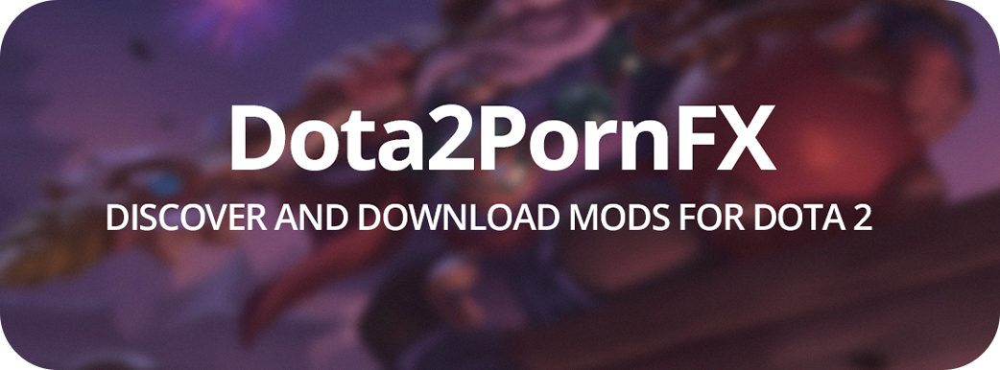

<div align="center">
  
  
  <h1>The largest free collection of Dota 2 customization mods</h1>

[](https://h6rd.github.io/Dota2PornFxWeb)
&nbsp;
[](https://d2pfxwiki.pages.dev/)
&nbsp;
[](https://github.com/h6rd/Dota2PornFxStatus#live-status)
&nbsp;
[](https://t.me/dota2pornfx)
&nbsp;
[](https://discord.com/invite/PBvG8D9MxT)

</div>

## What is Dota2PornFx?

**Dota2PornFx** is a comprehensive mod repository for Dota 2, giving players full control over the visual experience of their game. Browse and download custom hero skins, terrains, announcers, shaders, music, cursors, and much more.

---

## Features

| | |
|---|---|
| 🗂️ **30+ categories** | Heroes, terrains, shaders, announcers, music, cursors, and more |
| 🔄 **Regular updates** | New content and community contributions added frequently |
| 🛠️ **Tools** | VPK extraction, merging, and compilation utilities |

---

## Installation Guide

### Quick Start

1. Download the `.vpk` file(s) you want
2. Open **Steam**, **right-click on Dota 2** → **Manage** → **Browse local files**
3. Navigate to the `game` folder
4. Create the folder `dota_123` (or use)
5. Place your downloaded mods into that folder
6. Add `-language 123` to Dota 2 launch options in Steam

> **Using multiple mods?** If file names conflict, rename duplicates to `pakXX_dir.vpk` (e.g. `pak10_dir.vpk`, `pak11_dir.vpk`, etc.). Alternatively, use **[VPKMerge](https://h6rd.github.io/Dota2PornFxWeb/?category=tools&mod=VPKMerge+-+Combine+VPKs)** to combine them into a single file.
> 
> **Using Minify?** Place mods in the `dota_minify` folder and add `-language minify` to launch options instead.

---

<details>
<summary><b>Инструкция по установке</b></summary>

<br>

1. Скачайте нужный файл `.vpk`
2. Откройте Steam, нажмите правой кнопкой мыши (ПКМ) по Dota 2 → Управление → Просмотреть локальные файлы.
3. Перейдите в папку game
4. Переместите vpk файлы в папку `dota_russian`
5. Добавьте в параметры запуска: `-language russian`

> **Если используете Minify** — положите моды в папку языка которая указана в Minify

> **Важно:** Если имена файлов совпадают, переименуйте повторяющийся в `pakXX_dir.vpk`, где XX — 10, 11, 12... 99.
> Для объединения нескольких модов в один файл используйте **[VPKMerge](https://h6rd.github.io/Dota2PornFxWeb/?category=tools&mod=VPKMerge+-+Combine+VPKs)**.

</details>

---

## Tools & Utilities

| Tool | Description |
|------|-------------|
| [**VPKTool**](https://h6rd.github.io/Dota2PornFxWeb/?category=tools&mod=VPKTool+-+Extract+%26+Pack+VPKs) | Extract and repack VPK archives |
| [**VPKMerge**](https://h6rd.github.io/Dota2PornFxWeb/?category=tools&mod=VPKMerge+-+Combine+VPKs) | Merge multiple VPK files into one |
| [**Compiler**](https://h6rd.github.io/Dota2PornFxWeb/?category=tools&mod=Compiler) | Compile `.vtex_c`, `.vpcf_c`, `.vsnd_c`, `.vxml_c`, `.vcss_c` assets |

---

## Troubleshooting

<details>
<summary><b>Mod doesn't work after installation</b></summary>

<br>

To check whether the issue is with the mod itself or your installation:

1. Create a folder named `dota_test` inside `steamapps\common\dota 2 beta\game\`
2. Place the mod there and set launch options to `-language test`
3. Launch the game and check:
   - ✅ Works? → The original installation had an issue. Re-check your language folder and reinstall.
   - ❌ Still broken? → The mod itself is the problem.

</details>

<details>
<summary><b>Merged mods cause issues</b></summary>

<br>

Try installing the problematic mod separately, outside of the merged pack. Some mods conflict at the file level when combined.

</details>

<details>
<summary><b>Background replacement issues</b></summary>

<br>

- The video must be **30 seconds or shorter**
- File format must be **`.webm`**
- **"An error occurred during playback"** → Try a different source video
- **"Background doesn't change"** → Follow the general troubleshooting steps above

</details>

<details>
<summary><b>Emblems not visible</b></summary>

<br>

Open the in-game console and run:
```
r_draw_selected_ring 1
```

Also make sure you are not using the **Misc Optimization** mod from Minify, as it disables standard emblem rendering.

</details>

---

## Special Thanks

| Contributor | Contribution |
|-------------|--------------|
| [Egezenn](https://github.com/Egezenn) | Integration with [Minify](https://github.com/Egezenn/dota2-minify) and the [metadata generation script](https://github.com/h6rd/Dota2PornFxWeb/blob/main/scripts/add_meta.py) |
| [Fleece](https://github.com/TheFleece) | Creation of the [Dota 2 Mod Manager](https://github.com/TheFleece/dota2-mod-manager) |

---

## Credits

Content is sourced from the Dota 2 modding community. Original sources include:

- [**Dota2Changer**](https://dota2changer.com/)
- [**MOR**](https://vk.com/amir4anmods)

<details>
<summary><b>Mod Authors</b></summary>

<br>

[Egezenn](https://github.com/Egezenn) · [Robbyz](https://github.com/robbyz512) · [Darkness](https://t.me/Darkness_Logovo) · [Defiree](https://vk.com/defiree2mods) · [Kisilev](https://vk.com/id363951132) · [Amir4an](https://vk.com/amir4an) · [Skratch](https://www.youtube.com/@skratch) · [Lenz](https://www.youtube.com/@Lenz13377) · [Kliromin](https://www.youtube.com/@mrkliromin7723) · [Pinkpapa](https://www.patreon.com/Pinkpapa) · [laskotdota](https://t.me/laskotdota) · [NahuiToSay](https://t.me/NahuiToSay) · [lebensinhalt](https://t.me/turnoffyourlebensinhalt) · [Kynomi](https://vk.com/kynomi) · [Pinkie](https://steamcommunity.com/profiles/76561198142595363) · [VPKDota](https://t.me/vpkdota) · [ya_lyosha](https://www.twitch.tv/ya_lyosha) · [SanyaBane](https://steamcommunity.com/profiles/76561198072955043) · [Haruma](https://t.me/DotA_2_Mods) · kebabmaker · [YMOM77](https://t.me/mod_dota) · [Slipersone](https://t.me/slipersone) · [Timmyone](https://t.me/timmyone) · [HiddenPool](https://t.me/hiddenpoolcm) · [BackSpace](https://t.me/BackSpaceHub) · [zzzebra](https://vk.com/zzzfans) · [arti4e](https://t.me/d2modsreborn) · [Hooorde](https://steamcommunity.com/profiles/76561199405322406) · [HyrX](https://steamcommunity.com/profiles/76561198016243370) · [Sarath](https://steamcommunity.com/profiles/76561198127797541) · [Naix](https://www.youtube.com/channel/UCOfO6lf7jJO88NMlHDBkkCw) · [Shiro_R](https://t.me/shiro_rez) · [apathydxd](https://discord.com/users/538760177470668810) · [Dota2VPK](https://t.me/dota2freevpk) · [yoshimura](https://sites.google.com/view/yosh1mur2) · dabaqz · [Миша Талант](https://t.me/madberserker) · [Fr0dech](https://t.me/fr0dech_vpk) · DARK BLADE · [SkippingHades](https://www.youtube.com/@skippinghadesofficialmc) · [buba43](https://steamcommunity.com/profiles/76561199220865017) · [dikiychyvak](https://t.me/+7lqUU2tPN5A5ODNi) · [Ромчик](https://discord.com/users/290180519478427650) · [Mopsyara](https://t.me/+AM_aLD0x2TcwY2My) · [Vpotokwe](https://steamcommunity.com/sharedfiles/filedetails/?id=3766199700) · [Senop](https://t.me/senopD2) · [Arthas](https://t.me/+as5Zl_HLsIgyMjk6) · [DotaMiniProfile](https://t.me/DotaMiniProfile) · [Fleece](https://github.com/TheFleece) · [qizlik](https://t.me/qizlikmod) · [ПАПАНЯ НА ШАМАНЕ](https://steamcommunity.com/profiles/76561199483735695/)

</details>

---

## Libraries Used

| Library | Purpose |
|---------|---------|
| [zip.js](https://github.com/gildas-lormeau/zip.js/) | ZIP read/write in the browser |
| [lz-string](https://github.com/pieroxy/lz-string) | LZ-based string compression |
| [m3e](https://github.com/matraic/m3e) | Material 3 Expressive UI components |

---

## ⚠️ Disclaimer

Modifying game files is done **entirely at your own risk**. In the event of a ban or other consequences, responsibility lies solely with the user. This project is not affiliated with Valve Corporation or Dota 2.

## License

Contents of this repository are licensed under [GPL-3.0](LICENSE).
