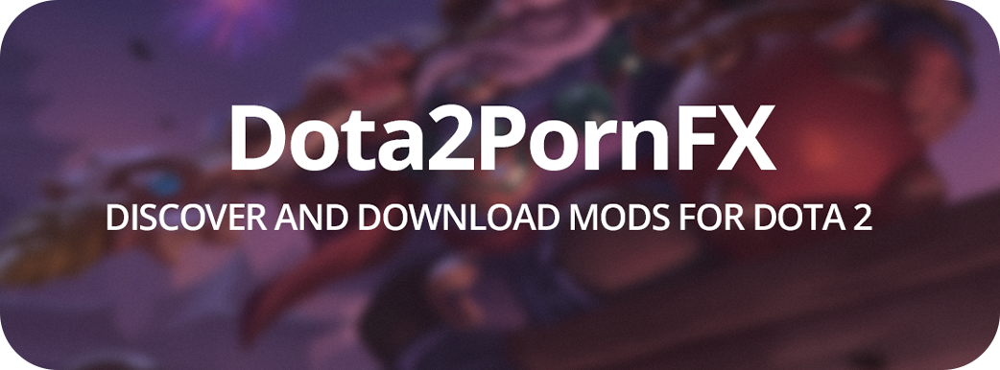
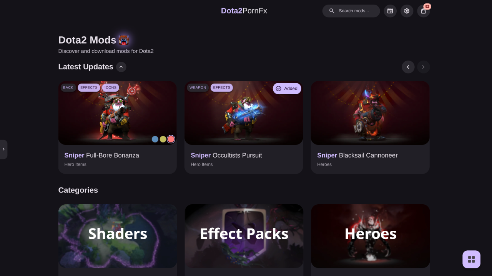
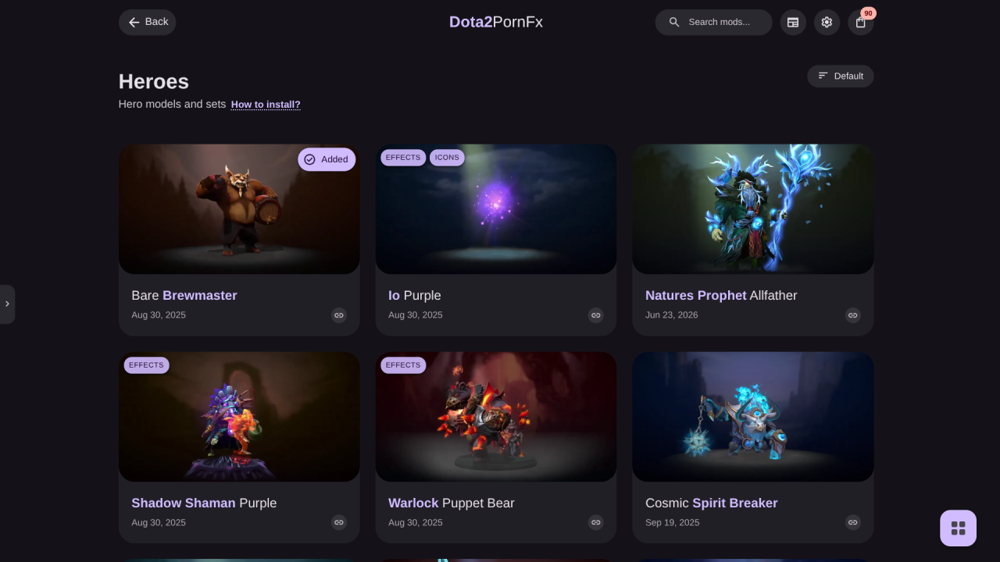
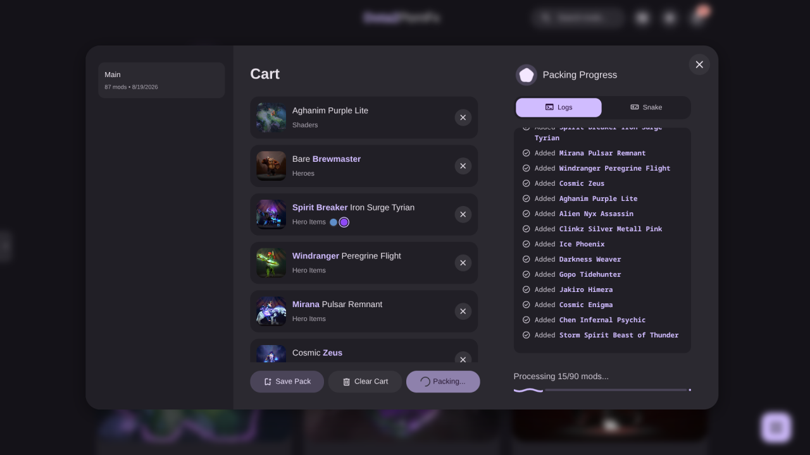

<div align="center">
  

  <h1>The largest FREE collection of Dota 2 customization mods</h1>

  <p>
    <a href="https://h6rd.github.io/Dota2PornFxWeb">
      
    </a>
    <a href="https://d2pfxwiki.pages.dev/">
      
    </a>
    <a href="https://github.com/h6rd/Dota2PornFxStatus#live-status">
      
    </a>
    <a href="https://t.me/dota2pornfx">
      
    </a>
    <a href="https://discord.com/invite/PBvG8D9MxT">
      
    </a>
  </p>

  <p>
    <a href="https://discord.com/invite/PBvG8D9MxT">
      
    </a>
    <a href="https://github.com/h6rd/Dota2PornFxWeb/commits">
      
    </a>
    <a href="LICENSE">
      
    </a>
  </p>
  <p>
    <a href="#features">Features</a> &nbsp;·&nbsp;
    <a href="#screenshots">Screenshots</a> &nbsp;·&nbsp;
    <a href="#project-activity">Activity</a> &nbsp;·&nbsp;
    <a href="https://d2pfxwiki.pages.dev/en/install.html">Installation</a> &nbsp;·&nbsp;
    <a href="#credits">Credits</a> &nbsp;·&nbsp;
    <a href="#attribution--reuse">Attribution</a>
  </p>
</div>

## What is Dota2PornFx?

**Dota2PornFx** is a comprehensive mod repository for Dota 2, giving players full control over the visual experience of their game. Browse and download custom hero skins, terrains, announcers, shaders, music, cursors, and much more.

---

## Features

| | |
|---|---|
| 🗂️ **30+ categories** | Heroes, terrains, shaders, announcers, music, cursors, and more |
| 🔄 **Regular updates** | New content and community contributions added frequently |
| 🛠️ **Tools** | VPK extraction, merging, and compilation utilities |

---

## Screenshots

<table>
  <tr>
    <td width="33%"></td>
    <td width="33%"></td>
    <td width="33%"></td>
  </tr>
  <tr>
    <td align="center"><b>Main page</b></td>
    <td align="center"><b>Heroes</b></td>
    <td align="center"><b>Cart</b></td>
  </tr>
</table>

---

## Project activity
 
<p align="center">
  
</p>
---

## [**Installation Guide**](https://d2pfxwiki.pages.dev/en/install.html) / [**Troubleshooting**](https://d2pfxwiki.pages.dev/en/troubleshoot.html)

---

## Special Thanks

| Contributor | Contribution |
|-------------|--------------|
| [Egezenn](https://github.com/Egezenn) | Integration with [Minify](https://github.com/Egezenn/dota2-minify) and the [metadata generation script](https://github.com/h6rd/Dota2PornFxWeb/blob/main/scripts/add_meta.py) |
| [Fleece](https://github.com/TheFleece) | Creation of the [Dota 2 Mod Manager](https://github.com/TheFleece/dota2-mod-manager) |
| [ibcsz](https://github.com/ibcsz12) | Added Santa hat to the logo for winter theme |

---

## Credits

Content is sourced from the Dota 2 modding community. Original sources include:

- [**Dota2Changer**](https://dota2changer.com/)
- [**MOR**](https://vk.com/amir4anmods)

<details>
<summary><b>Mod Authors</b></summary>

<br>

[Egezenn](https://github.com/Egezenn) · [Robbyz](https://github.com/robbyz512) · [Darkness](https://t.me/Darkness_Logovo) · [Defiree](https://vk.com/defiree2mods) · [Kisilev](https://vk.com/id363951132) · [Amir4an](https://vk.com/amir4an) · [Skratch](https://www.youtube.com/@skratch) · [Lenz](https://www.youtube.com/@Lenz13377) · [Kliromin](https://www.youtube.com/@mrkliromin7723) · [Pinkpapa](https://www.patreon.com/Pinkpapa) · [laskotdota](https://t.me/laskotdota) · [NahuiToSay](https://t.me/NahuiToSay) · [lebensinhalt](https://t.me/turnoffyourlebensinhalt) · [Kynomi](https://vk.com/kynomi) · [Pinkie](https://steamcommunity.com/profiles/76561198142595363) · [VPKDota](https://t.me/vpkdota) · [ya_lyosha](https://www.twitch.tv/ya_lyosha) · [SanyaBane](https://steamcommunity.com/profiles/76561198072955043) · [Haruma](https://t.me/DotA_2_Mods) · kebabmaker · [YMOM77](https://t.me/mod_dota) · [Slipersone](https://t.me/slipersone) · [Timmyone](https://t.me/timmyone) · [HiddenPool](https://t.me/hiddenpoolcm) · [BackSpace](https://t.me/BackSpaceHub) · [zzzebra](https://vk.com/zzzfans) · [arti4e](https://t.me/d2modsreborn) · [Hooorde](https://steamcommunity.com/profiles/76561199405322406) · [HyrX](https://steamcommunity.com/profiles/76561198016243370) · [Sarath](https://steamcommunity.com/profiles/76561198127797541) · [Naix](https://www.youtube.com/channel/UCOfO6lf7jJO88NMlHDBkkCw) · [Shiro_R](https://t.me/shiro_rez) · [apathydxd](https://discord.com/users/538760177470668810) · [Dota2VPK](https://t.me/dota2freevpk) · [yoshimura](https://sites.google.com/view/yosh1mur2) · dabaqz · [Миша Талант](https://t.me/madberserker) · [Fr0dech](https://t.me/fr0dech_vpk) · DARK BLADE · [SkippingHades](https://www.youtube.com/@skippinghadesofficialmc) · [buba43](https://steamcommunity.com/profiles/76561199220865017) · [CeoMods](https://t.me/modsceo) · [Ромчик](https://watchmy.bio/shidehara) · [Mopsyara](https://t.me/+AM_aLD0x2TcwY2My) · [Vpotokwe](https://steamcommunity.com/sharedfiles/filedetails/?id=3766199700) · [Senop](https://t.me/senopD2) · [Arthas](https://t.me/ArthasModMaker) · [DotaMiniProfile](https://t.me/DotaMiniProfile) · [Fleece](https://github.com/TheFleece) · [qizlik](https://t.me/qizlikmod) · [ПАПАНЯ НА ШАМАНЕ](https://steamcommunity.com/profiles/76561199483735695/) · [SuperStas0](https://t.me/SuperStas0) · [Tenkay](https://t.me/dota2Tenkay) · [Aven](https://t.me/Aven1337) · [lansory](https://discord.com/users/1108248721768071210) · [333](https://t.me/cousf) · [depex](https://t.me/depexfx) · [cutyourhand](https://discord.com/users/835877516303925298) · [CiDDi](https://steamcommunity.com/profiles/76561198087399221) · [3atvorn1k](https://discord.com/users/642254136053596200) · [keeper](https://t.me/eternalsadism) · [spectr](https://discord.com/users/1531254146559250438) · hatsu · [hanfukj](https://t.me/hanfukj) · [Niski25](https://github.com/cus-nyam) · [lssqqqq](https://t.me/lssqqqq) · [hltw](https://discord.com/users/1012077862355996722) · [zitock](https://steamcommunity.com/profiles/76561198790474721/) · [wannakissyou](https://t.me/Ilya0sipov) · [александр](https://t.me/+VY-_XaaDg00wYmI6) · [YuyaKizami](https://t.me/YuyaKizami) · Morecursed · [ibcsz](http://t.me/nixwaretop) · Новомодный  · [J0nathan550](https://github.com/J0nathan550) · [мс яйцо](https://steamcommunity.com/id/mcegg/) · [rasstegai](https://steamcommunity.com/id/rasstegai/) · [твавт](https://steamcommunity.com/id/myasu0/) · [XIIIpsiblade](https://t.me/XIIIpsiblade) · [illidan](https://t.me/illidan888) · [shears001](https://discord.com/users/1204344805748903948) · [Harlord](https://t.me/harlord_mods) · [драг](https://t.me/dragvpk) · [Gibus](https://steamcommunity.com/id/nqkln/) · [cursedseizures](https://t.me/drainAngel) · [1995rnx](https://t.me/rnx1995rnx) · [YZT](https://t.me/YZTdota)

</details>

---

## Shoutouts to Streamers & Guide Creators

Special thanks to those who share these mods with their audience through streams, videos, and installation guides:

<details>
<summary><b>Content Creators</b></summary>

<br>

| Creator | Platform |
|---------|----------|
| Lenz | [YouTube](https://www.youtube.com/@Lenz13377) |
| romantic | [Twitch](https://www.twitch.tv/romantic991) / [TikTok](https://www.tiktok.com/@romantic_9991) |
| hanta | [YouTube](https://www.youtube.com/@hqnta) |
| dricsy66 | [YouTube](https://www.youtube.com/@dricsy66) |
| Jez4 | [YouTube](https://www.youtube.com/@Jez4444) |
| SNOW SUCKER | [YouTube](https://www.youtube.com/@AYE22814) |
| hypothermia | [TikTok](https://www.tiktok.com/@methedonetherapy) |
| 0cyzdau | [TikTok](https://www.tiktok.com/@0cyzdau) |
| nedavovchik | [TikTok](https://www.tiktok.com/@nedavovchik) |
| pr1me | [TikTok](https://www.tiktok.com/@pr1meee_999) |

</details>

---

## Libraries Used

| Library | Purpose |
|---------|---------|
| [zip.js](https://github.com/gildas-lormeau/zip.js/) | ZIP read/write in the browser |
| [lz-string](https://github.com/pieroxy/lz-string) | LZ-based string compression |
| [m3e](https://github.com/matraic/m3e) | Material 3 Expressive UI components |

---

## Attribution & Reuse

This repository is distributed under [GPL-3.0](LICENSE). If you reuse, mirror, or redistribute mods or any other part of it, the following attribution terms apply (additional terms under GPLv3 §7(b)):

1. **Credit Dota2PornFx.** Link to the website (https://h6rd.github.io/Dota2PornFxWeb) and to this repository (https://github.com/h6rd/Dota2PornFxWeb) in a visible place (description, README or UI).
2. **Keep the authors.** Credit the original mod authors listed in [Credits](#credits) for the mods you use, and do not remove existing author tags or watermarks.
3. **Don't present it as your own.** Don't claim the collection or its mods as your work or as an official source, and don't use the name "Dota2PornFx" to suggest endorsement of your project.

**Mods without a listed author or source** are credited to **h6rd / Dota2PornFx**. If you publish such a mod, you must always credit **h6rd** with a link to the website and this repository, and please ask me first via Discord: `.hrdq`.

Ready-to-copy text:

```
Mods from [Dota2PornFx](https://h6rd.github.io/Dota2PornFxWeb), repository: https://github.com/h6rd/Dota2PornFxWeb.
Original mod authors: https://github.com/h6rd/Dota2PornFxWeb#credits
```

> **Let me know.** For any other mods, this is not required, but if you republish, mirror, or bundle this collection, please drop me a message on Discord: `.hrdq` with a link, so I can check that the credits are correct.


### Approved projects
 
[Dota2 Minify](https://github.com/Egezenn/dota2-minify) and [Dota 2 Mod Manager](https://github.com/TheFleece/dota2-mod-manager) use this catalog with my permission.


### Third-party and Valve content

This collection contains mods made by other community authors (credited above) and files that belong to **Valve**. Rights to those works remain with their respective owners. This repository's license applies only to what the maintainer has the right to license and does not grant rights to third-party or Valve material.

---

## ⚠️ Disclaimer

Modifying game files is done **entirely at your own risk**. In the event of a ban or other consequences, responsibility lies solely with the user. This project is not affiliated with Valve Corporation or Dota 2.

## License

Contents of this repository are licensed under [GPL-3.0](LICENSE), subject to the [attribution terms](#attribution--reuse) above and the rights of third parties and Valve.